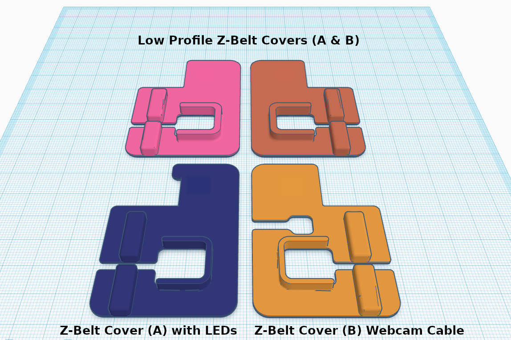

# Low Profile Z-Belt Covers

## BOM
N/A

## Improvement
Lower profile requiring less clearance than the standard z-belt covers.

## Description
Currently the Voron manual instructs users to leave approximately 3mm between the bottom of the z rails and the frame. For people (like me) who measured EXACTLY 3mm (or possibly slightly less), they probably found out way too late that the standard z-belt covers won't fit. The problem with this is that to raise the z rails once the printer is built is pretty labor intensive. Personally, I am lazy and found it easier to simply lower the profile of the stock parts so they would fit.

While I was modfying and testing fit, I noticed that the press fit was quite secure, so I removed the bolt holes entirely.

On my machine, I use a small wire channel for the LEDs to route to the electronics bay, as well as a larger channel for the cable running from the Logitech C270 webcam I have setup for monitoring. I lowered the profile of both of these as well.

## Pictures

## Print settings
As stated in the Voron documentation:
* ABS
* 0.2mm layer hight
* 0.4mm extrusion width
* 40% infill
* wall count 4
* top/bottom layers 5
* no supports

## Credits
1. LDO Team: https://github.com/MotorDynamicsLab/LDOVoron2/blob/main/STLs/z_belt_cover_a_led.stl
2. FunFunBoy: https://www.printables.com/model/84736-z-belt-cover-a-for-voron-24
3. Team VoronDesign: Thanks for the incredible design and all of your hard work!